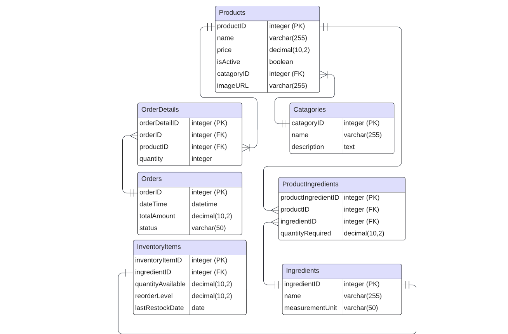

# Rev's Grille POS

# Group Members:
Mohammad Rafay  
Amaan Chaudhry  
Ezra Jeter  
Aiden Stickney  
Robert Way  
Roshan Sreedhar

# Our correctness-demonstrating scripts:

"Retrieve All Active Products within sides Category"

This SQL script retrieves all active products within the "Sides" category. It selects the name, price, and image URL of products that are marked as active and belong to the "Sides" category.

“Find Products with Low Inventory Items” 

This script finds products with low inventory items. It selects the name of the product and the quantity available from the inventory items table where the quantity available is less than or equal to the reorder level.

“Report Total Sales by Product”

This SQL script generates a report of total sales by product. It calculates the total quantity sold and the total sales amount for each product by joining the order details with the products table and grouping the results by product name.

“Report on Orders grouped by Status”

This script provides a report on orders grouped by status. It counts the number of orders and calculates the total sales amount for each order status by grouping the orders table by status.

“List of Orders Placed on a 4/9/2023 with Details”

This script lists orders placed on April 9, 2023, along with their details such as order ID, datetime, total amount, status, product name, and quantity. It joins the orders, order details, and products tables to retrieve the required information for the specified date.

“Updates Inventory After Restocking 50 fries”

This script updates the inventory after restocking 50 units of fries. It increases the quantity available for fries by 50 and updates the last restock date for the fries' ingredients.

“Deactivate Products Not Sold in Last Year”

This SQL updates products that have not been sold in the last year by deactivating them. It sets the isActive flag to FALSE for products whose IDs are not found in the order details table for orders placed within the past year.

“List Categories with the Number of Active Products”

This script lists categories with the number of active products within each category. It counts the number of active products for each category by joining the categories and products tables and filtering active products.

“Find Orders Above $150”

This script selects orders with a total amount above $150. It retrieves order ID, datetime, total amount, and status from the orders table where the total amount exceeds $150.

“Average Price of Products within Each Category”

This SQL script calculates the average price of products within each category. It calculates the average price for each category by joining the categories and products tables and grouping the results by category name.

“Sales Trend per month for Fries”

This script shows the sales trend per month for fries. It calculates the total quantity of fries sold each month by joining the orders and order details tables and filtering for fries, then grouping the results by month.

“Select Count of Orders Grouped by Week”

This script selects the count of orders grouped by week. It extracts the year and week number from the order datetime, counts the number of orders for each week over the past year, and orders the results by year and week number.

“Select Count of Orders, Sum of Order Total Grouped by Hour”

This script selects the count of orders and the sum of orders total grouped by hour of the day. It extracts the hour from the order datetime, counts the number of orders, and calculates the total sales amount for each hour.

“Select Top 10 Sums of Order Total Grouped by Day in Descending Order by Order Total”

This script selects the top 10 sums of order total grouped by day in descending order by order total. It calculates the total sales amount for each day and selects the top 10 days with the highest sales.

“Select Count of Inventory Items from Inventory and Menu Grouped by Menu Item”

This script selects the count of inventory items from the inventory and menu grouped by menu item. It counts the number of unique ingredients for each product by joining the product ingredients and products tables and orders the results by ingredient count in descending order, limiting to the top 20 results.

# Current ERD Diagram

# Current Schema
#### 1. Categories
  Primary Key: categoryid
  
  Attributes: name, description
  
  Relationships: One-to-Many with products (one category can have many products).
#### 2.Ingredients
  Primary Key: ingredientid
  
  Attributes: name, measurementunit
  
  Relationships:
    One-to-Many with inventoryitems (one ingredient can have many inventory items).
    Many-to-Many with products through productingredients (one ingredient can be in many products; one product can have many ingredients).
#### 3. InventoryItems
  Primary Key: inventoryitemid
  
  Foreign Key: ingredientid references ingredients
  
  Attributes: quantityavailable, reorderlevel, lastrestockdate
#### 4. OrderDetails
  Primary Key: orderdetailid
  
  Foreign Keys:
    orderid references orders
    productid references products
    
  Attributes: quantity
#### 5. Orders
  Primary Key: orderid
  
  Attributes: datetime, totalamount, status
  
  Relationships: One-to-Many with orderdetails (one order can have many order details).
#### 6. ProductIngredients
  Primary Key: productingredientid
  
  Foreign Keys:
    productid references products
    ingredientid references ingredients
    
  Attributes: quantity
  
  Purpose: This table serves as a junction table for the Many-to-Many relationship between products and ingredients.
#### 7. Products
  Primary Key: productid
  
  Foreign Key: categoryid references categories
  
  Attributes: name, price, isactive, imageurl
  
  Relationships:
    One-to-Many with orderdetails (one product can be part of many order details).
    Many-to-Many with ingredients through productingredients.

